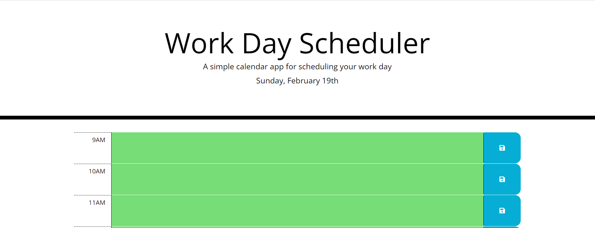

# Daily Planner App

This is a web application that allows users to plan their day by creating to-do items for each hour of the day. It uses the Moment.js library to display the current date and time, and to color-code each timeblock based on whether it is in the past, present, or future.

## Features
- Displays the current date and time at the top of the page
- Each hour of the day is displayed as a timeblock
- Timeblocks are color-coded based on whether they are in the past, present, or future
- Users can create to-do items for each hour by typing them into the corresponding timeblock
- To-do items can be saved to local storage by clicking the "save" button for each timeblock
- Saved to-do items persist even if the user closes and reopens the application

## Link 🔗
[LINK](https://xiacodes.github.io/JS-Daily-Planner-App/)
